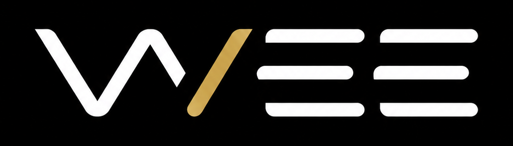
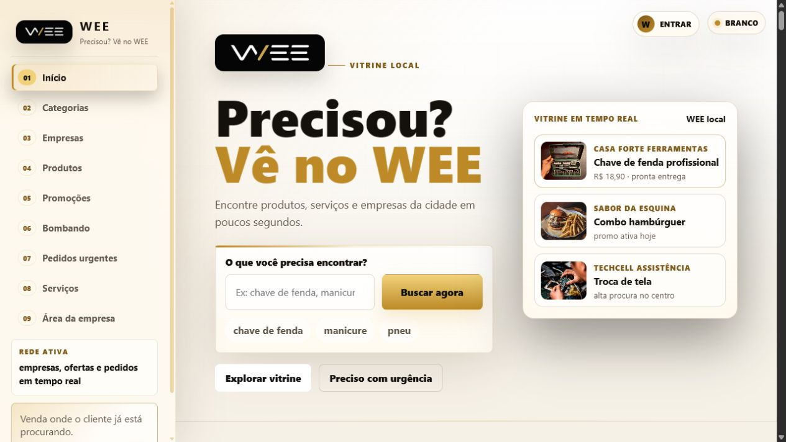
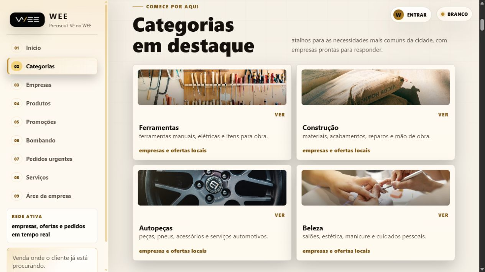
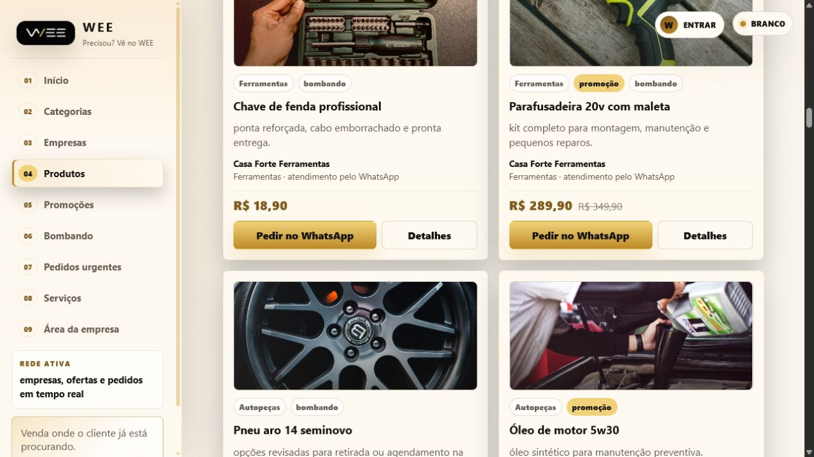

  

  # WEE - Vitrine local inteligente

  **Produtos, serviços e empresas da cidade em uma experiência rápida, confiável e conectada ao WhatsApp.**

  
  
  
  

  [Ver demonstração online](https://azure-elephant-481277.hostingersite.com/)

> Este repositório é exclusivamente um showcase. O código-fonte, as configurações de produção e os dados da plataforma são privados.

## Sobre o projeto

O WEE é uma plataforma de descoberta e intermediação comercial local. A experiência aproxima clientes de empresas e prestadores da região por meio de uma vitrine organizada, busca inteligente e contatos rastreados pelo WhatsApp.

O projeto foi desenhado para atender três públicos com jornadas próprias:

- **Clientes:** encontram produtos, serviços, promoções e empresas locais.
- **Empresas e prestadores:** publicam e administram seus próprios itens.
- **Administrador:** acompanha a operação, os cadastros e os indicadores comerciais da plataforma.

## Experiência

- Busca por produtos, serviços, categorias, promoções e empresas.
- Categorias visuais para facilitar a descoberta local.
- Vitrines de produtos e serviços com preços, imagens e detalhes.
- Página pública dedicada para cada empresa cadastrada.
- Perfis de usuário com autenticação e foto.
- Contato pelo WhatsApp condicionado ao login do cliente.
- Registro identificado dos contatos para controle da intermediação.
- Pedidos urgentes e agendamento de serviços.
- Tema claro e escuro com identidade visual preto, branco e dourado.
- Navegação responsiva para desktop, tablet e celular.

## Operação

O painel administrativo foi estruturado para a rotina do Wesley, responsável pela intermediação do WEE. Ele reúne gestão de categorias, empresas, prestadores, produtos, pedidos e cadastros, além de paginação e seções recolhíveis para manter a leitura clara mesmo com o crescimento da base.

Entre os indicadores internos estão:

- Produtos mais acessados.
- Termos mais buscados pelos clientes.
- Histórico recente de busca por perfil.
- Contatos de WhatsApp por usuário, produto e empresa.
- Métricas gerais de acesso e interação.
- Sistema configurável de pontos e ranking.

## Direção visual

A identidade combina preto, branco e dourado para criar uma percepção premium sem comprometer a clareza. A sidebar fixa organiza a navegação no desktop, enquanto o mobile adota um menu compacto. Tipografia forte, fotografias comerciais e microinterações reforçam a personalidade da marca sem transformar a vitrine em um painel genérico.

O conceito central da comunicação é simples:

> **Precisou? Vê no WEE.**

## Arquitetura

| Camada | Solução |
| --- | --- |
| Interface | HTML semântico, CSS autoral e JavaScript |
| Backend | API em PHP 8 |
| Banco de dados | MySQL com consultas preparadas |
| Sessões e acesso | Autenticação por perfil e controle de permissões |
| Arquivos | Upload de imagens para perfis, empresas e produtos |
| Integração comercial | WhatsApp com mensagens contextualizadas e tracking |
| Hospedagem | Apache e MySQL na Hostinger |

## Minha atuação

Conduzi o projeto de ponta a ponta, da definição do produto à publicação:

- Estratégia de produto e organização dos requisitos.
- Direção de arte e construção da identidade visual.
- UX/UI para clientes, empresas, prestadores e administrador.
- Desenvolvimento frontend e responsividade.
- Backend, banco de dados, autenticação e permissões.
- Analytics de busca, visualizações e contatos comerciais.
- Preparação e implantação em ambiente de produção.

## Status

O WEE está em evolução contínua e preparado para receber os dados reais de empresas e produtos da operação local.

---

  Projeto desenvolvido por <strong>Marcelo Schuermann</strong>.

